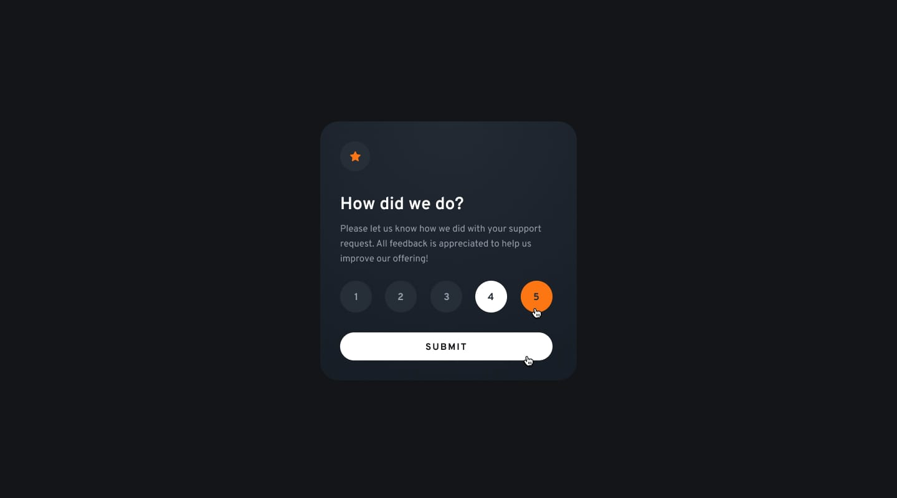

# Frontend Mentor - Interactive rating component solution

This is a solution to the [Interactive rating component challenge on Frontend Mentor](https://www.frontendmentor.io/challenges/interactive-rating-component-koxpeBUmI). Frontend Mentor challenges help you improve your coding skills by building realistic projects.

## Table of contents

- [Overview](#overview)
  - [The challenge](#the-challenge)
  - [Screenshot](#screenshot)
- [My process](#my-process)
  - [Built with](#built-with)
  - [What I learned](#what-i-learned)
- [Author](#author)

**Note: Delete this note and update the table of contents based on what sections you keep.**

## Overview

### The challenge

Users should be able to:

- View the optimal layout for the app depending on their device's screen size
- See hover states for all interactive elements on the page
- Select and submit a number rating
- See the "Thank you" card state after submitting a rating

### Screenshot



## My process

### Built with

- Semantic HTML5 markup
- CSS custom properties
- Flexbox
- Javascript

### What I learned

I learnt about making interactive rating components use HTML, CSS, and Javascript. I learnt a lot the interactive use Javascript about changing automatically the numbers when it click submitted and return it into thank you card. some highlight that I learnt from this challenges are:

```js
submitButton.addEventListener("click", () => {
  thanksContainer.classList.remove("hidden");
  mainContainer.style.display = "none";
});

rating.forEach((rate) => {
  rate.addEventListener("click", () => {
    rates.innerHTML = rate.innerHTML;
  });
});
```

## Author

- Portfolio - [Salma Adinda Nisa](https://salma-adinda-nisa-portfolio.framer.website/)
